<h1 style="text-align: center;">IT Inventory Django Application</h1>

 

<h2 style="text-align: center;">IT Inventory is a CMDB application inspired by the need to replace an Excel file as a tool.</h2>

 

<h4 style="text-align: center; font-style: italic;">After launching the application, the first registered user becomes a superuser and creates one time an organization to which all created businesses are connected. All other newly registered users have staff status, and they can only manage the businesses they have created.</h4>

## 1. Database
Account Models:
- InventoryUser
  - **email** - EmailFiled, unique, required
  - **date_joined** - DateTimeFiled
  - **is_staff** - BooleanFiled
  - **is_active** - BooleanFiled

- Profile
  - **first_name** - CharField
  - **last_name** - CharField
  - **profile_pic** - ImageField
  - **phone_number** - CharField
  - **is_first_login** - BooleanField, default=True
  - **account** - OneToOneField to **InventoryUser**

Business Models:
- Business
  - **business_name** - CharField, unique, required
  - **country** - CharField, required
  - **is_visible** - BooleanFiled, default=True
  - **organization** - ForeignKey to **Organization**
  - **owner** - ForeignKey to **InventoryUser**

Devices Models:
- Devices
  - **device_name** - CharField, unique, required
  - **domain** - CharField
  - **description** - TextField
  - **status** - CharField, choices
  - **category** - CharField, choices
  - **sub_category** - CharField, choices
  - **manufacturer** - CharField
  - **model** - CharField
  - **ip_address** - GenericIPAddressField
  - **ip_address_sec** - GenericIPAddressField
  - **serial_number** - CharField, unique, required
  - **operating_system** - CharField
  - **building** - CharField
  - **business_processes_at_risk** - TextField
  - **impact** - IntegerField, default=1
  - **likelihood** - IntegerField, default=1
  - **support_model** - TextField
  - **purchase_order_number** - IntegerField
  - **invoice_img** - FileField
  - **sos** - DateField
  - **eos** - DateField
  - **eol** - DateField
  - **owner_name** - CharField
  - **supplier** - ForeignKey to **Supplier**
  - **business** - ForeignKey to **Business**

Organization Models:
- Organization
  - **organization_name** - CharField, required
  - **region** - CharField, choices
  - **logo** - ImageField

Supplier Models:
- Supplier
  - **name** - CharField, required, unique
  - **contact_name** - CharField, required
  - **supplier_country** - CharField, required
  - **phone_number** - CharField
  - **email** - EmailFiled, required

## 2. Routes

Accounts
- `http://localhost:8000/accounts/login/` - User login
- `http://localhost:8000/accounts/register/` - User registration
- `http://localhost:8000/accounts/logout/` - User logout
- `http://localhost:8000/accounts/edit/<int:pk>/` - User edit profile
- `http://localhost:8000/accounts/details/` - User profile details
- `http://localhost:8000/accounts/password_change/` - User change password
- `http://localhost:8000/accounts/password_change/done/` - Password change done

Business
- `http://localhost:8000/business/<int:pk>/` - Business details
- `http://localhost:8000/business/create/` - Create a business
- `http://localhost:8000/business/edit/<int:pk>/` - Edit business
- `http://localhost:8000/business/<int:business_id>/device/create/` - Create device
- `http://localhost:8000/business/<int:business_id>/upload-csv/` - Upload device form .csv file

Common
- `http://localhost:8000/` - Dashboard
- `http://localhost:8000/home/` - Home page  
- `http://localhost:8000/data/` - ???

Devices
- `http://localhost:8000/device/edit/<int:pk>/` - Edit device
- `http://localhost:8000/device/delete/<int:pk>/` - Delete device
- `http://localhost:8000/device/download-template/` - Download template

Organization
- `http://localhost:8000organization/create/` - Create organization
- `http://localhost:8000organization/edit/<int:pk>` - Edit organization

Suppliers
- `http://localhost:8000/supplier/` - List of suppliers
- `http://localhost:8000/supplier/create/` - Create supplier 
- `http://localhost:8000/supplier/edit/<int:pk>/` - Edit supplier
- `http://localhost:8000/supplier/delete/<int:pk>/` - Delete supplier

## 3. Pages

### Dashboard
**If the user is not logged in:** When the user is not registered in the header he will see a Login and Register buttons and Dashboard page gives short description of web application.

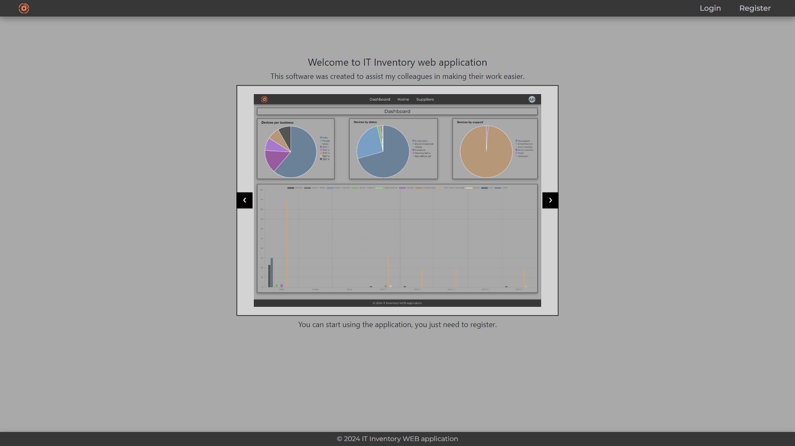

**If the user is logged in:** When user is logged the Dashboard shows graphics includes aggregate information.

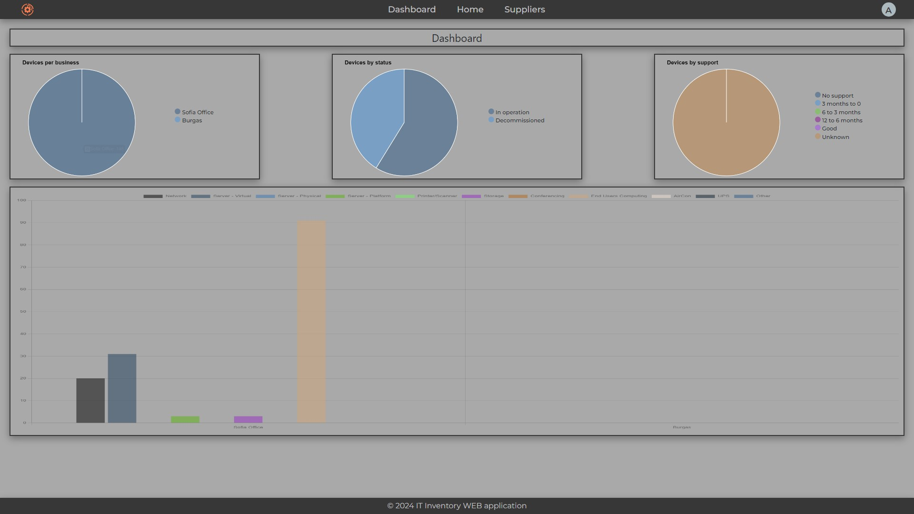

### Home

This page is available only for registered users. Contains stats about all created business, total devices, suppliers and registered users (Engineers). Logged in user can create or edit owned business also can see the business created by other users.

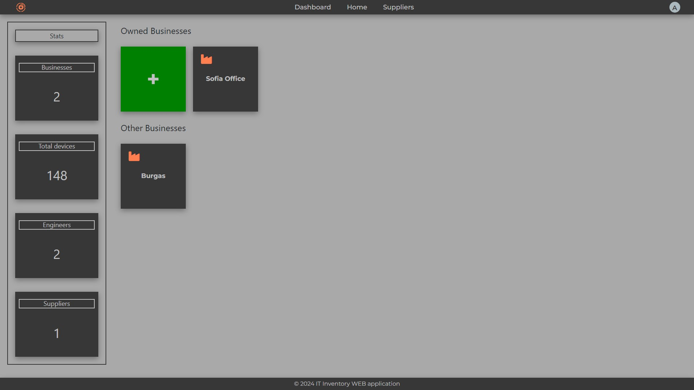

The logo located in left upper corner is clickable only for first registered user (superuser). There is an option to change the settings of organization.

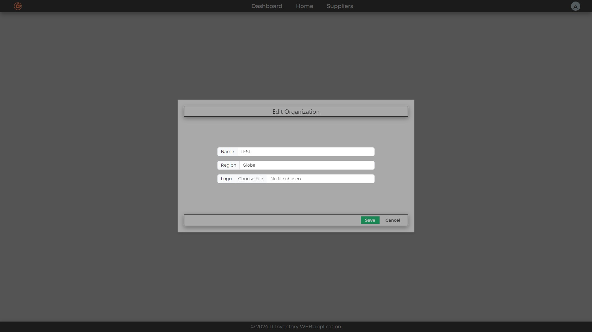

### Selected Business

On the first row are stats related to the specific business. Each stat has clickable function to filter devices table.
Each `Hostname` is clickable and following to device edit form.

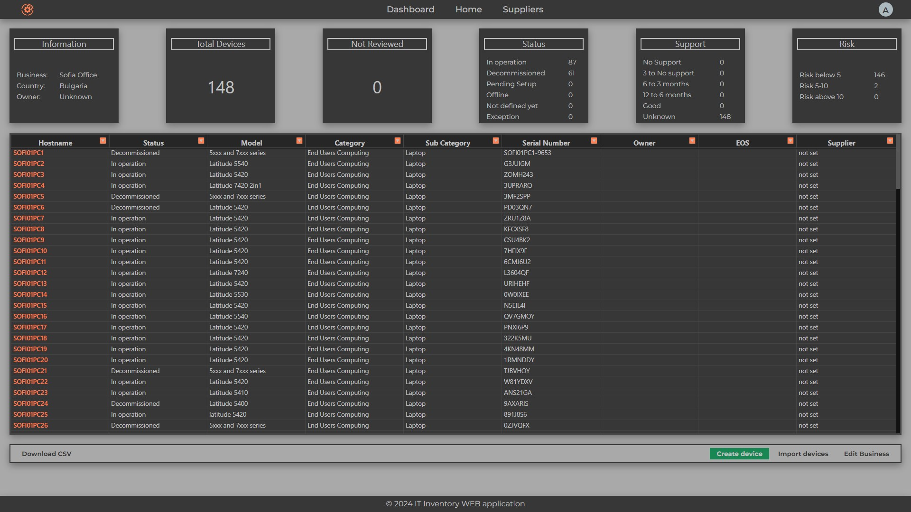

Business can be edit clicking the button `Edit Business` which leads to the opening of business edit form.

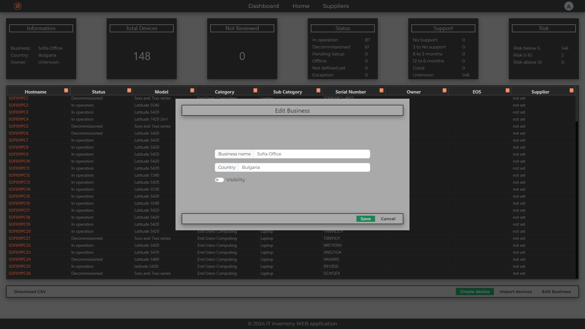

There is a possibility user to upload devices via .xlsx file form button `Import devices`. The preferred template to use when uploading can be downloaded form button `Download template file`.

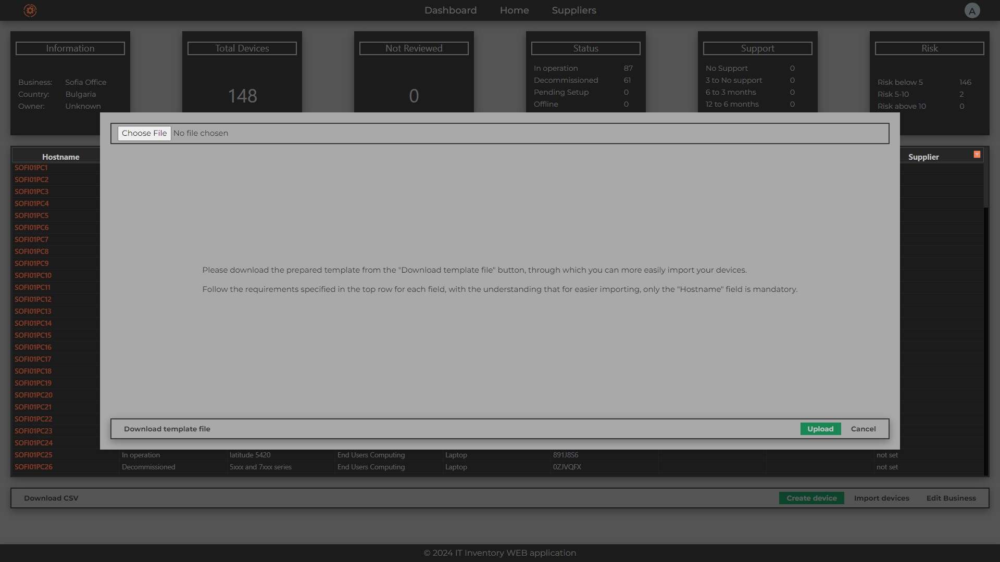

### Devices

Device can be created when business is selected via button `Create device`. There is a two mandatory and unique fields (Hostname and Serial Number).

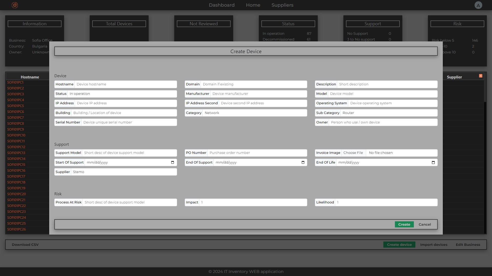

Device can be edit when business is selected user click on loaded Hostname.

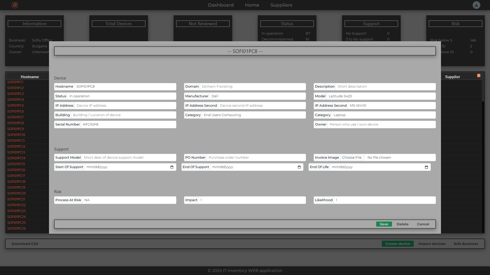

### Suppliers

On `Suppliers` tab are listed all suppliers created from all users. There is a option for search by supplier name.

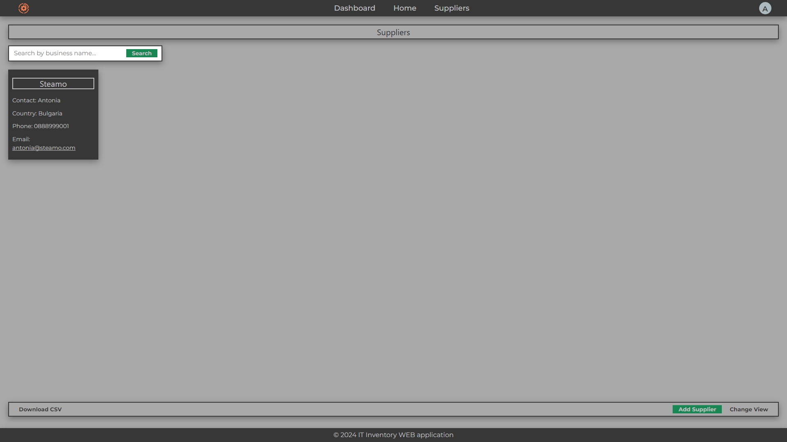

On current view all boxes are clickable from where supplier can be edited.

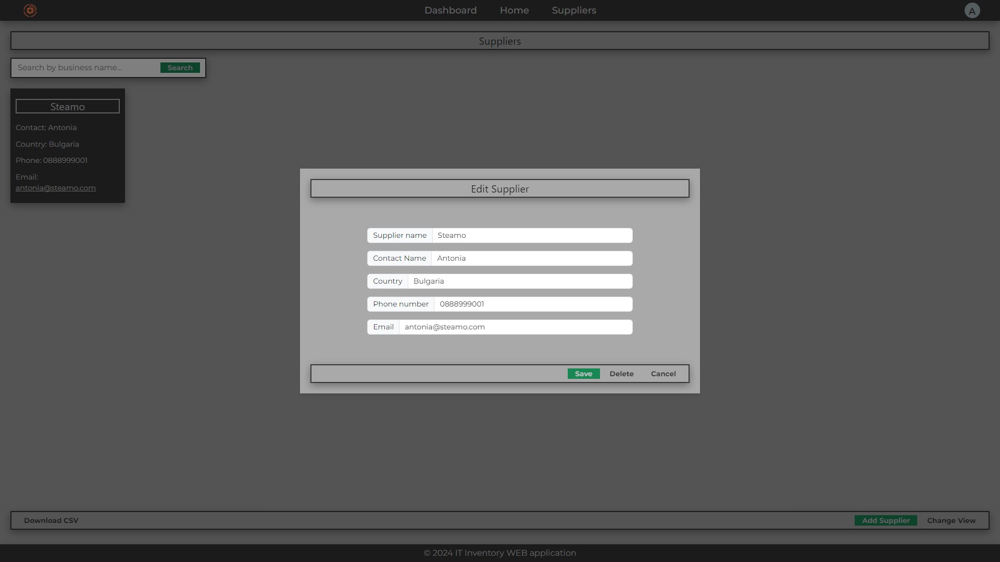

 With button `Change View` supplier list switch to table view.

 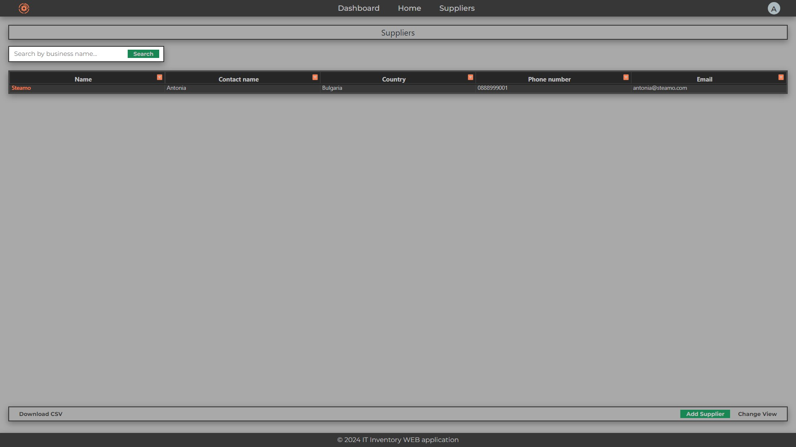

### Account dropdown

The initials or user picture (if setted up) are clickable. From there user has options to change `Profile` settings, change his password and log out.

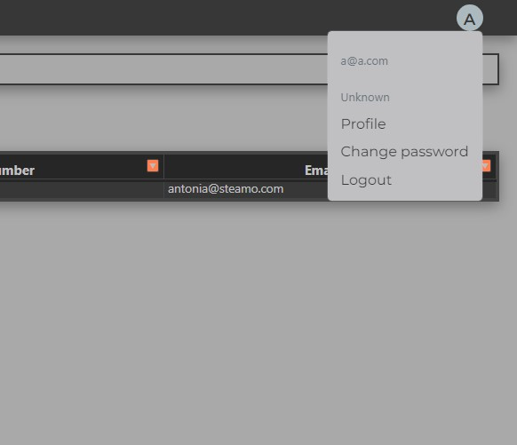

Profile details.

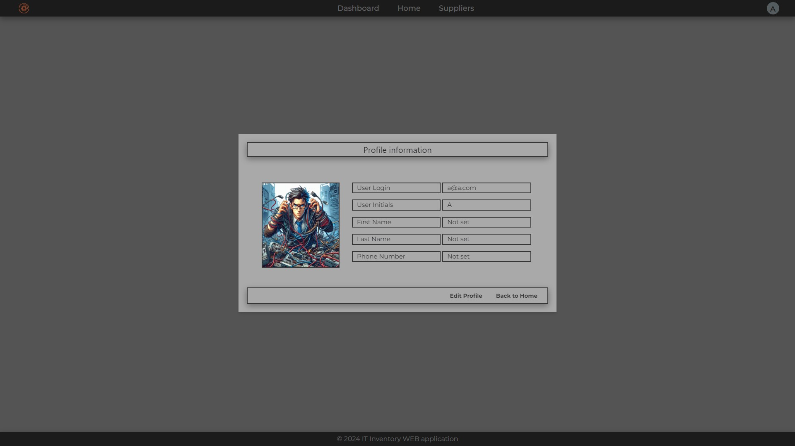

Change password.

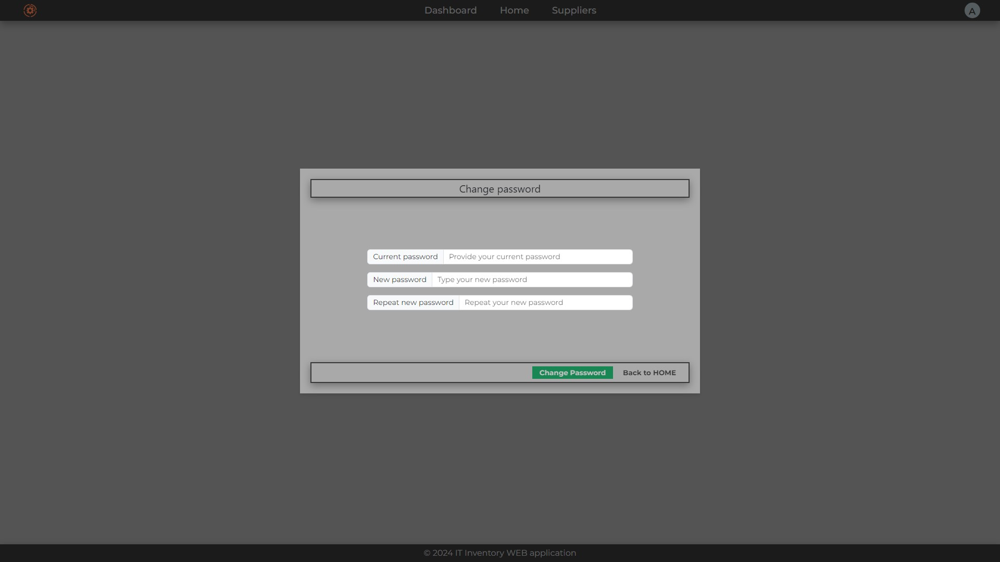